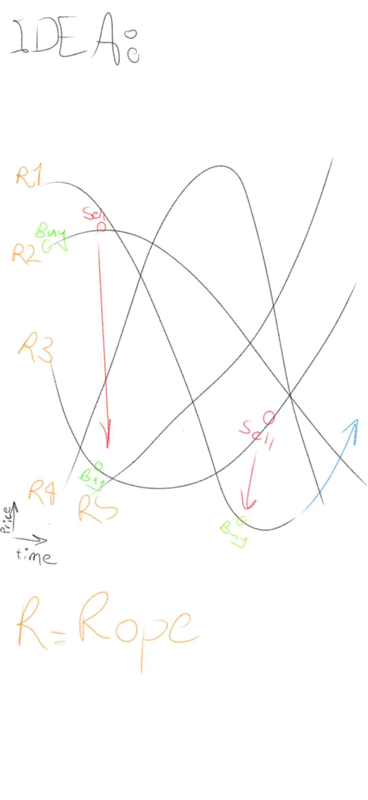

# mastrade
MasTrade is a trading bot in baselines3,pytorch,gym

# idea
we have for example 1 btc
and we buy a crypto with it with market option to 
trade in fastest speed
so we fastly swich to USDT and again to another unstable currency.
we never will not be on stable quot coin(USDT)
we just use it to reach to the other unstable coin or rope!
and trying to swim and dive inside the charts
think about the agent as a monkey that jumping on ropes
and try to go upeer and upper
also in each epoch we update the charts with a value that we will 
have in btc if we buy it

#jff
